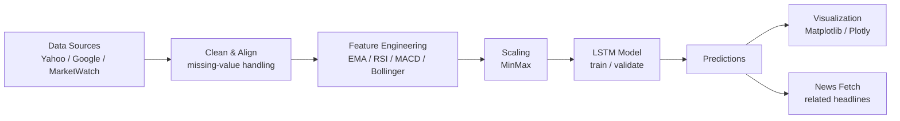

# Stock-Price-Prediction-Using-LSTM


This project is a stock price prediction workflow built in a Jupyter notebook using an LSTM (Long Short-Term Memory) model. It fetches historical stock data, applies technical indicators, trains an LSTM model, predicts future prices, and visualizes actual vs predicted prices. It can optionally fetch recent stock-related news headlines.

---

##  Features

-  **Stock price fetching** from Yahoo Finance, Google Finance, MarketWatch, or Investing.com.
-  **LSTM model** to predict next-day stock prices.
-  **Interactive visualizations** using Plotly and Matplotlib.
-  **Technical indicators** like RSI, MACD, Bollinger Bands, and EMA.
-  **Latest news headlines** related to the stock ticker.
-  **Fallback sample data generator** when no stock data is available.

---

##  Architecture



- **Ingestion**: Pulls latest quotes and historical candles from multiple providers with fallback.
- **Indicators**: Computes EMA/RSI/MACD/Bollinger for richer temporal features.
- **Model**: LSTM sequence model trained on scaled price windows; tuned for next-day close.
- **Outputs**: Predicted price, matplotlib/Plotly charts, and latest related headlines.

---

##  Project Structure

```
Stock-Price-Prediction-Using-LSTM/
├── STOCK_PRICE_PREDICTION_USING_LSTM_AND_WEB_SCRAPING.ipynb  # Main notebook
└── README.md
```

> To run in Google Colab, upload the notebook and follow the cells in order.

---

##  How It Works

### 1. Fetch Stock Data
The script uses multiple sources (Yahoo, Google, MarketWatch) to retrieve real-time and historical stock data.

### 2. Feature Engineering
Calculates technical indicators:
- EMA (Exponential Moving Average)
- RSI (Relative Strength Index)
- MACD (Moving Average Convergence Divergence)
- Bollinger Bands

### 3. Model Training
The LSTM model is trained on past stock prices (scaled with MinMaxScaler) to learn patterns and trends.

### 4. Prediction & Visualization
- Predicts the next day’s stock price.
- Plots actual vs predicted prices using both Matplotlib and Plotly.

### 5. News Fetching
Scrapes latest headlines related to the company from Google News.

---

##  Setup (Local)

```bash
python -m venv .venv
. .venv/Scripts/activate  # PowerShell: .venv\Scripts\Activate.ps1
pip install -r requirements.txt  # if present, otherwise install the deps below
```

Then open the notebook `STOCK_PRICE_PREDICTION_USING_LSTM_AND_WEB_SCRAPING.ipynb` and run the cells sequentially.

---

##  Example Usage

```python
predictor = StockPredictor('AAPL')
predictor.predict()
predictor.display_actual_vs_predicted()
predictor.display_plotly_graph()
predictor.fetch_news()
```

---

##  Dependencies

Install the following packages if not using Colab (or use `requirements.txt` if available):

```bash
pip install yfinance beautifulsoup4 lxml plotly tensorflow scikit-learn
```

If you're using **Google Colab**, most libraries are pre-installed.

---

##  Notes

- Works best with stock symbols from **NASDAQ**, **NYSE**, etc.
- If all sources fail (e.g., ticker is invalid or internet is down), synthetic data is generated.
- Modify sequence length, model structure, or add new indicators for improved accuracy.

---

##  Author

**Sidharth Kumar Reddy**  
Hyderabad, India  
sidkr725@gmail.com  
[GitHub](https://github.com/SidIos25)

---

## License

This project is open-source and free to use under the [MIT License](https://opensource.org/licenses/MIT).
